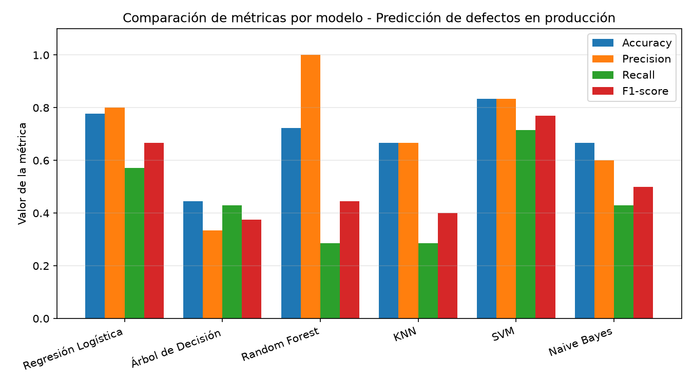

# Predicción de Defectos en Producción con Machine Learning Supervisado

Implementación y comparación de Regresión Logística y cinco algoritmos de clasificación supervisada (Árbol de Decisión, Random Forest, SVM, KNN y Naive Bayes) sobre un caso de estudio de control de calidad industrial.

> Trabajo académico — actividad **R1-A2-S8: Informe de Trabajo – ML Supervisado**, asignatura Introducción a Machine Learning, CADI, Universidad de Cundinamarca.

## Tabla de contenido

- [Caso de estudio](#caso-de-estudio)
- [Contenido del repositorio](#contenido-del-repositorio)
- [Algoritmos implementados](#algoritmos-implementados)
- [Resultados](#resultados)
- [Cómo ejecutar el notebook](#cómo-ejecutar-el-notebook)
- [Tecnologías](#tecnologías)
- [Autor](#autor)

## Caso de estudio

La empresa manufacturera **XYZ Inc.** necesita anticipar si un lote de producción saldrá **defectuoso (1)** o **no defectuoso (0)**, a partir de cinco variables del proceso productivo:

| Variable | Descripción |
|---|---|
| `temperatura` | Temperatura de la máquina (°C) |
| `presion` | Presión del sistema (bar) |
| `velocidad` | Velocidad de producción (unidades/min) |
| `hora_operacion` | Horas continuas de operación de la máquina |
| `vibracion` | Nivel de vibración de la máquina |

Un lote defectuoso implica pérdidas económicas, reprocesos, devoluciones y afectación de la calidad. Por eso, el objetivo no es solo maximizar aciertos totales, sino **detectar a tiempo los lotes que realmente saldrán defectuosos**, lo que hace del *recall* la métrica más relevante del ejercicio, sin dejar de lado el resto de métricas de evaluación.

## Contenido del repositorio

```
.
├── Caso_Produccion_ML_Supervisado.ipynb   # Notebook ejecutado (Google Colab / Jupyter)
├── comparacion_metricas.png               # Gráfica comparativa de métricas por modelo
└── README.md
```

El notebook incluye, en orden:

1. Generación del dataset simulado (60 lotes).
2. División en conjuntos de entrenamiento y prueba.
3. Entrenamiento e interpretación de la Regresión Logística.
4. Entrenamiento de los cinco algoritmos de clasificación adicionales.
5. Cálculo de métricas por modelo: accuracy, precisión, recall, F1-score, validación cruzada (5 particiones) y matriz de confusión.
6. Tabla comparativa final y gráfica de resultados.
7. Análisis e interpretación de cada métrica.

## Algoritmos implementados

- Regresión Logística
- Árbol de Decisión
- Random Forest
- Support Vector Machine (SVM)
- K-Nearest Neighbors (KNN)
- Naive Bayes

## Resultados

Conjunto de prueba: 18 lotes (11 no defectuosos, 7 defectuosos).

| Modelo | Accuracy | Precisión | Recall | F1-score | CV Promedio |
|---|---|---|---|---|---|
| **SVM** | 0.833 | 0.833 | **0.714** | **0.769** | **0.750** |
| Regresión Logística | 0.778 | 0.800 | 0.571 | 0.667 | 0.733 |
| Random Forest | 0.722 | **1.000** | 0.286 | 0.444 | 0.700 |
| Naive Bayes | 0.667 | 0.600 | 0.429 | 0.500 | 0.700 |
| KNN | 0.667 | 0.667 | 0.286 | 0.400 | 0.667 |
| Árbol de Decisión | 0.444 | 0.333 | 0.429 | 0.375 | 0.667 |

**SVM** obtuvo el mejor equilibrio entre precisión y recall, y fue el modelo más estable bajo validación cruzada. Random Forest alcanzó precisión perfecta, pero a costa del recall más bajo del grupo: resultó demasiado conservador para un problema donde lo prioritario es no dejar pasar lotes defectuosos.



## Cómo ejecutar el notebook

**Opción 1: Google Colab**

Abrir directamente el notebook en Colab con este enlace:

[](https://colab.research.google.com/github/JoanBeltranAlt/ml-supervisado-caso-produccion/blob/main/Caso_Produccion_ML_Supervisado.ipynb)

Una vez abierto, ejecutar todas las celdas con `Entorno de ejecución > Ejecutar todas`.

**Opción 2: Entorno local**
```bash
pip install pandas numpy matplotlib scikit-learn jupyter
jupyter notebook Caso_Produccion_ML_Supervisado.ipynb
```

## Tecnologías

- Python 3
- [pandas](https://pandas.pydata.org/) y [NumPy](https://numpy.org/) para el manejo de datos
- [scikit-learn](https://scikit-learn.org/) para los modelos y métricas
- [Matplotlib](https://matplotlib.org/) para la visualización

## Autor

**Joan Schneider Beltrán Delgado**
Especialización en Inteligencia Artificial, Universidad de Cundinamarca
